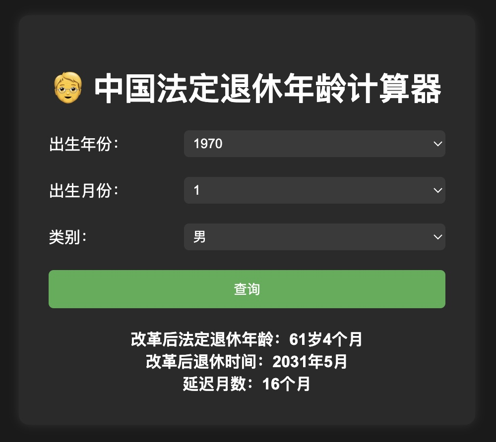

# 中国法定退休年龄计算器
China Legal Retirement Age Calculator
- 这是一个用于计算中国法定退休年龄的小工具。根据用户输入的性别和出生日期，返回预计的退休年龄、退休日期以及延迟的月数。
- This is a tool for calculating the statutory retirement age in China. Based on the user's input of gender and birth date, it returns the expected retirement age, retirement date, and the number of delayed months.

## Demo
Try it on: https://china-legal-retirement-age-calculator.vercel.app/



## Core Logic
```javascript
// 男性
const maleConfig = {
    startYear: 1965,
    incrementMonths: 4,
    maxDelayMonths: 36,
    formerRetireAge: 60
};

// 女性（原50岁退休）
const female50Config = {
    startYear: 1975,
    incrementMonths: 2,
    maxDelayMonths: 60,
    formerRetireAge: 50
};

// 女性（原55岁退休）
const female55Config = {
    startYear: 1970,
    incrementMonths: 4,
    maxDelayMonths: 36,
    formerRetireAge: 55
};

function calculateRetirement(year, month, config) {
    const {startYear, incrementMonths, maxDelayMonths, formerRetireAge} = config;

    // 计算出生月份离起始年的总月份数
    const totalMonths = Math.max(0, (year - startYear) * 12 + (month - 1));

    // 延迟退休的月份数
    let delayMonths = year < startYear ? 0 : Math.min(Math.floor(totalMonths / incrementMonths) + 1, maxDelayMonths);

    // 总工作月份数
    let workMonths = formerRetireAge * 12 + delayMonths;

    // 退休时间（退休年月）
    const retireDate = new Date(year, month - 1 + workMonths);
    const retireYear = retireDate.getFullYear();
    const retireMonth = retireDate.getMonth() + 1;

    // 退休年龄 = 前退休年龄 + 延迟年（延迟月数 / 12）
    const retireAgeYears = formerRetireAge + Math.floor(delayMonths / 12);
    const retireAgeMonths = delayMonths % 12;

    return {
        retireYear,      // 退休年份
        retireMonth,     // 退休月份
        retireAgeYears,  // 退休时年龄（年）
        retireAgeMonths, // 退休时年龄（月）
        delayMonths      // 延迟退休的月份数
    }
}
```

Demo:
```javascript
// 计算男性退休年龄
// calculateRetirement(1970, 1, maleConfig)
// {retireYear: 2031, retireMonth: 5, retireAgeYears: 61, retireAgeMonths: 4, delayMonths: 16}

// 计算女性退休年龄（原50岁退休）
// calculateRetirement(1980, 1, female50Config)
// {retireYear: 2032, retireMonth: 8, retireAgeYears: 52, retireAgeMonths: 7, delayMonths: 31}

// 计算女性退休年龄（原55岁退休）
// calculateRetirement(1990, 1, female55Config)
// {retireYear: 2048, retireMonth: 1, retireAgeYears: 58, retireAgeMonths: 0, delayMonths: 36}
```
